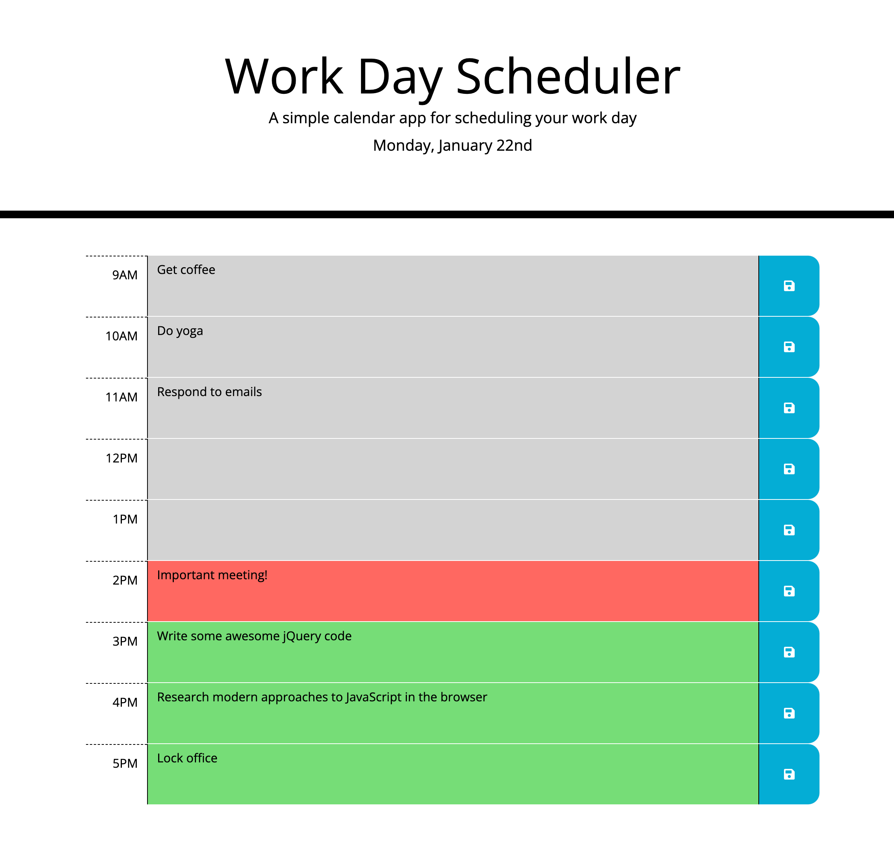

# Work Day Scheduler

## Description
Work Day Scheduler is a simple calendar application that allows a user to save events for each hour of the day. The app runs in a browser and features dynamically updated HTML and CSS powered by jQuery.



## Installation

Please clone this repository with the following command in your terminal:

```
git clone https://github.com/jamesaps/work-day-scheduler.git
```

## Usage
This site is designed to automatically deploy to github pages when changes are committed to the main branch. You can find a link to a live version of the site [here](https://jamesaps.github.io/work-day-scheduler/).

## Credits
* Starter code provided by edX Boot Camps LLC.

## License

Licensed under the [MIT](https://github.com/jamesaps/work-day-scheduler/blob/main/LICENSE) license.

© 2024 James Stott. Confidential and Proprietary. All Rights Reserved.